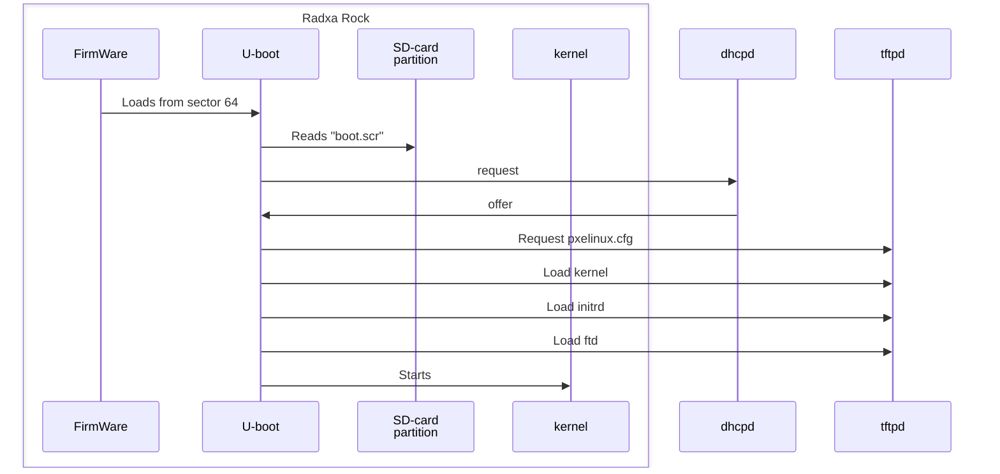

# Rock computer

I got a [Radxa ROCK 4 SE](https://wiki.radxa.com/Rock4/se) on sale for
1/3 of the price, so I couldn't resist. I don't want to use a distro,
but want to build everything from scratch, cross-compile and net-boot.
If you *want* a distro, [Armbian](https://www.armbian.com/) is the
best I have found (but watch up for [this issue](
https://github.com/armbian/community/issues/39)).

If you want to try for instance different kernels, it is *very*
inconvenient to flash-and-switch the SD-card all the time. The way to
go is network booting. Radxa Rock 4 is said to support network boot,
but requires a [serial cable and manual intervention](
https://wiki.radxa.com/Rockpi4/dev/u-boot/pxe). I don't want that! The
board should do a pxe boot automatically. This repo describes how it
can be done with a (very) small SD-card.  A wired network is required
(wifi is not supported).

[Development and contributions](#development-and-contributions) are
described below.

If you have another board than Radxa Rock 4se, please see
[Rebuild sd.img](#rebuild-sdimg) below.

Most things are done with the `admin.sh` script.

```
./admin.sh                    # help printout
./admin.sh env                # current settings
./admin.sh versions           # Used versions and download/clone status
```

Everything is built in `$ROCK_WORKSPACE`, which defaults to
"/tmp/tmp/$USER/ROCK". Default for options can be set as environment
variables. Example:

```
export __dev=enp5s0
export __local_addr=192.168.40.1/24
export __dns=192.168.10.1
```


## Flash the SD-card

Find a `sd-rock-4se-rk3399.img.xz` in [releases](
https://github.com/uablrek/rock-computer/releases), download and
decompress:


```
xz -d sd-rock-4se-rk3399.img.xz
```

Unfortunately there is a problem with the u-boot `serverip` variable. It
*should* be set by the "serverid" DHCP option (54), but I have not got
that working (see [below](#serverip)). So for now you must set it to
the address of your `tftp` server manually:

```
./admin.sh set_serverip --sdimage=sd-rock-4se-rk3399.img <address-to-your-tftp-server>
```
(problems with this? Please see
[Development and contributions](#development-and-contributions))

Now you can flash your SD-card:
```
dev=<device-of-your-sd-card>     # THIS MUST BE RIGHT!!
sudo dd if=sd-rock-4se-rk3399.img of=$dev status=progress oflag=dsync bs=4M
```
**WARNING**: If `dev` points to the wrong device (like your hard-disk),
it **will be destroyed!**

You are done! Insert the SD-card and power-on your board, and it will
boot from network.

If you want to alter your SD-card, please check [SD-card layout](
#sd-card-layout) below.


## Network boot

Boot sequence (simplified):



On power-on the board will now obtain an address via `DHCP` and
request a `pxelinux` configuration via `tftp` on a number of
places. An easy way to find out *where* is to check the `tftp` server
logs (narrowed):

```
atftpd[175531]: Serving pxelinux.cfg/01-f6-0b-6e-84-77-ec to 192.168.40.138:3284
atftpd[175531]: Serving pxelinux.cfg/C0A8288A to 192.168.40.138:3311
atftpd[175531]: Serving pxelinux.cfg/C0A8288 to 192.168.40.138:3366
atftpd[175531]: Serving pxelinux.cfg/C0A828 to 192.168.40.138:3485
atftpd[175531]: Serving pxelinux.cfg/C0A82 to 192.168.40.138:3607
atftpd[175531]: Serving pxelinux.cfg/C0A8 to 192.168.40.138:3728
atftpd[175531]: Serving pxelinux.cfg/C0A to 192.168.40.138:3846
atftpd[175531]: Serving pxelinux.cfg/C0 to 192.168.40.138:3964
atftpd[175531]: Serving pxelinux.cfg/C to 192.168.40.138:4085
atftpd[175531]: Serving pxelinux.cfg/default-arm-rk3399-rockpi4-rk3399 to 192.168.40.138:1139
atftpd[175531]: Serving pxelinux.cfg/default-arm-rk3399 to 192.168.40.138:1260
atftpd[175531]: Serving pxelinux.cfg/default-arm to 192.168.40.138:1383
atftpd[175531]: Serving pxelinux.cfg/default to 192.168.40.138:1502
```

Make sure that *any* of these files is a `pxelinux.cfg` file, looking
something like:

```
label Linux
    kernel Image
    initrd initrd
    append console=ttyS2,115200n8
    fdt rock.dtb
```

U-boot will load `Image`, `initrd` and `rock.dtb` and start Linux with
the command line in "append". The boot files are different for
everybody, so I can't say what they *should be*. I describe how I do
in [Kernel test](#kernel-test) below.


## Network and server setup

A wired network is assumed. I use wifi for internet, so my wired
interface, `enp5s0`, is free and used as an example. You may configure
your wired interface yourself, or use my script. Example:

```
./admin.sh interface_setup --dev=enp5s0 --local-addr=192.168.40.1/24
# (requires sudo)
```

`Dhcp` and `tftp` servers are needed. You may setup those in your
own way (there re plenty of instructions), or you can use my script.

I use the `udhcpd` applet in [BusyBox](https://busybox.net/).
`BusyBox` is included in Ubuntu, but you may have to build it locally.

```
#./admin.sh busybox_build --local   # source archive must be downloaded
#export __busybox=/path/to/local/built/busybox
./admin.sh dhcpd --dev=enp5s0 --local-addr=192.168.40.1/24
# (requires sudo)
```

I did not get any pre-buit `tftp` server to work, so I build
[atftp](https://github.com/madmartin/atftp) locally. Download the `tar.gz`
package from the [tags page](https://github.com/madmartin/atftp/tags).

```
./admin.sh atftp_build
./admin.sh tftpd --local-addr=192.168.40.1/24 --tftproot=/tmp/tftproot
# (requires sudo)
```

## SD-card layout

The SD-image is 54MiB, but your SD-card is much larger. This mean that
the backup GPT table is in the wrong place. Example:

```
sudo sfdisk -l /dev/sdb
GPT PMBR size mismatch (110591 != 15523839) will be corrected by write.
The backup GPT table is not on the end of the device.
Disk /dev/sdb: 7.4 GiB, 7948206080 bytes, 15523840 sectors
Disk model: SD Card         
Units: sectors of 1 * 512 = 512 bytes
Sector size (logical/physical): 512 bytes / 512 bytes
I/O size (minimum/optimal): 512 bytes / 512 bytes
Disklabel type: gpt
Disk identifier: 3681BD8A-F200-4B40-A742-782D81AE6147

Device     Start    End Sectors Size Type
/dev/sdb1  32768 102399   69632  34M EFI System
```

This doesn't matter if you only use the SD-card for network boot, and
it will be corrected by `sfdisk` if you add a partition.

```
echo ",,L," | sudo sfdisk --append /dev/sdb
sudo mkfs.ext4 /dev/sdb2
```

You may note that the EFI partition starts at sector 32768? That's
because the `u-boot` binary is written on sector 64 and occupies ~10M
space.


## Rebuild sd.img

This will be necessary for other boards. You must download `u-boot`
the `tar.gz` package from it's [tags page](
https://github.com/u-boot/u-boot/tags), and `trusted-firmware-a`
from it's [tags page](
https://github.com/TrustedFirmware-A/trusted-firmware-a/tags).
Now build u-boot for another board:

```
#export __board=rock-4c-plus-rk3399   # and skip --board below
./admin.sh trustedf_build
./admin.sh uboot_build --board=rock-4c-plus-rk3399 --default
./admin.sh sdimage --board=rock-4c-plus-rk3399
```

The available configurations can be found in the `configs/` directory
in the u-boot source (unpacked in `$ROCK_WORKSPACE/u-boot-*`). I can build
the `rock-4*` configurations, but not others. You may want to alter
the configuration, at least set default baud-rate to 115200.

The config is stored in `$__ubootcfg` which defaults to
`config/uboot-$__board.config`. Do **not** use `--default` again! For
subsequent updates use:

```
./admin.sh uboot_build --board=rock-4c-plus-rk3399 --menuconfig
```

## Serverip

The U-boot `serverip` variable is needed for `tftp`. It *should* be
set automatically from the "serverid" DHCP option (54), but for me it
remains undefined after dhcp. I have made a packet capture, and the
option *is* included in the dhcp-offer.

I have also checked the U-boot source, and it *looks like* it is set.
I am still trouble-shooting this...


## Serial console

You don't need a serial console just for network boot, but for
development you basically must have it.

The [Radxa documentation](https://wiki.radxa.com/Rockpi4/dev/serial-console)
is still valid (for once). I bought
"Oiyagai 2pcs Debug Cable for Raspberry Pi USB Programming" from Amazon for
120SEK (~$12). They can't do 1.5Mbps, but 115200 is totally sufficient, and
since we build `u-boot` we can set the default baud-rate.

**Update**: One of my Oiyagai Debug Cable has broken already, and the
  device is lost about twice a day and has to be removed/re-inserted.
  You might want to avoid the cheap stuff.

```
#sudo apt install minicom
alias minicom='minicom -w -t xterm -l -R UTF-8'
cat > ~/.minirc.rockpi4 <<EOF
pu port             /dev/ttyUSB0
pu baudrate         115200
pu bits             8
pu parity           N
pu stopbits         1
pu rtscts           No
EOF
minicom rockpi4
#ctrl-A Z for help
#ctrl-A X to exit
```

## Development and Contributions

Issues and PR's are welcome. Please note that the license is `CC0-1.0`,
meaning that everything you contribute will become public domain.

I use Ubuntu Linux, `24.04.2 LTS` at the moment. Other Linux distros
should work (with some tweaks), but are not tested.

The `bin/mkimage` program included in the repo, used by
`set_serverip`, is built on my PC. It will work for most Linux
distros, but if not, you must build `u-boot` locally as described in
[Rebuild sd.img](#rebuild-sdimg).

You *may* want to set $ROCK_WORKSPACE to a non-temp directory.

Source archives must be downloaded (by you).
```
./admin.sh versions
linux-6.15.6         (archive missing!)
busybox-1.36.1       (/home/uablrek/archive/busybox-1.36.1.tar.bz2)
atftp-0.8.0          (/home/uablrek/Downloads/atftp-0.8.0.tar.gz)
u-boot-2025.07       (/home/uablrek/Downloads/u-boot-2025.07.tar.gz)
trusted-firmware-a-lts-v2.12.4 (/home/uablrek/Downloads/trusted-firmware-a-lts-v2.12.4.tar.gz)
```

If you only want to [Rebuild sd.img](#rebuild-sdimg) you will not need
the kernel nor busybox.


### Kernel test

After research, and queries in forums, and *many* attempts, I have come
to the conclusion that *you can't use vanilla kernels from
https://kernel.org/*. The kernels *must* be patched to get all
functionality for any Radxa Rock. The vanilla kernels *do* boot
though, but I can't get graphics to work, and I haven't even tried
USB, sound, video, wifi, etc.  The serial console and (wired) ethernet
works, so you can build and test (and if your use-case is some kind of
network server, you are good to go).


First download the source archives:
```
./admin.sh versions                   # check
eval $(./admin.sh versions --brief)   # set them in your shell
curl -L --output-dir $HOME/Downloads -O https://cdn.kernel.org/pub/linux/kernel/v6.x/$ver_kernel.tar.xz
curl -L --output-dir $HOME/Downloads -O https://busybox.net/downloads/$ver_busybox.tar.bz2
./admin.sh versions                   # check again
```

With defaults:
```
./admin.sh kernel_build               # (will unpack to $KERNELDIR)
./admin.sh busybox_build
./admin.sh initrd_build initrd/default
#initrd/default/tar - | tar t         # To see contents of initrd
./admin.sh tftp_setup                 # (assuming atftp is used)
# boot!
```

If everything goes well, you will get a shell as root on the serial
console, and you can `telnet` to the board (no passwd).


### Re-test speedup

Usually testing kernels includes *many* rebuild+restart cycles, so you
want them to be fast.  Here are some convenient settings:

```
eval $(./admin.sh env | grep WS=)
export __pxe_file=<your 01-f6-0b-6e-84-77-ec>  # Limit the tftp search
export __tftp_setup=yes                        # Auto-update tftpd on kernel-build
export INITRD_OVL="initrd/default"             # Auto-update initrd on kernel-build
export KCFG_BACKUP=$WS/saved-configs           # Save kernel configs
alias admin=$PWD/admin.sh
alias cdws="cd $WS"
alias lscfg="ls $KCFG_BACKUP"
```

Now, to test a new kernel setting, just do:
```
admin kernel-build --menuconfig
# Reset your board, and watch the console...
```

If you mess up (and you will), then restore a working config with:
```
lscfg      # Pick some working config
admin kernel-build --menuconfig --restoreconfig=<your-pick>
```

### Date and time

Radxa Rock 4se has no hardware clock, so the `initrd` tries to set the
date with [rdate](https://linux.die.net/man/1/rdate). First it
tries the DHCP `serverid`, which is you PC (normally), then
`time.nist.gov` if that fails. You may start a time-server with:

```
./admin.sh busybox_build --local
./admin.sh time-server            # (requires sudo. Opens port 37)
```

The time-zone is specified in `initrd/default/root/etc/env`, which you
may override with `--env=` to "initrd_build". The timezone database is
**NOT available!** Meaning settings like "Europe/Stockholm" will *not
work*. You must set `TZ` the [posix way](
https://www.gnu.org/software/libc/manual/html_node/TZ-Variable.html).

Example:
```
man 3 tzset
export TZ=CET-1CEST-2,M3.5.0,M10.5.0/3      # (the default)
```